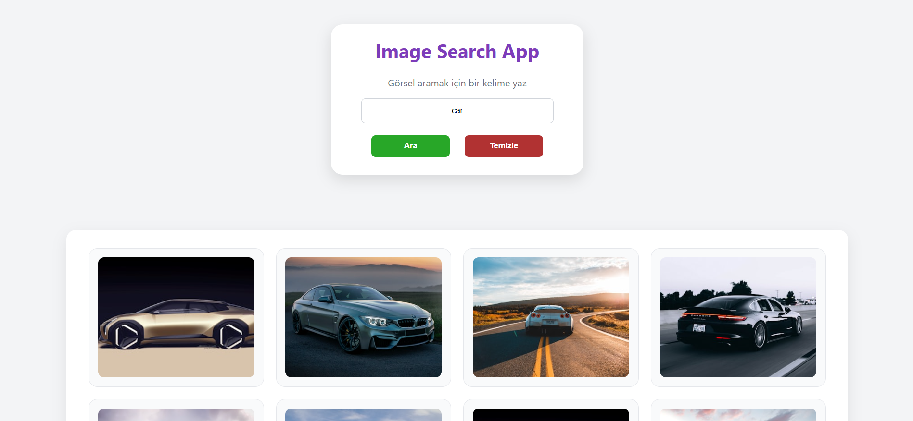

# 🖼️ Image Search App

This project is a web application that allows users to search for images using keywords.  
Images are fetched dynamically from the Unsplash API and displayed in a clean card layout.

## 🔗 Live Demo
https://fehmi-gunay.github.io/image-search-app/

## 📸 Screenshots

## 🚀 Features
- Search images by keyword
- Fetch data from Unsplash API
- Display results dynamically
- Loading state indicator
- Error handling for empty input
- Message display for no results
- Clear results functionality
- Responsive and user-friendly design

## 🛠️ Technologies Used
- HTML5
- CSS3 (Flexbox)
- JavaScript (Fetch API)
